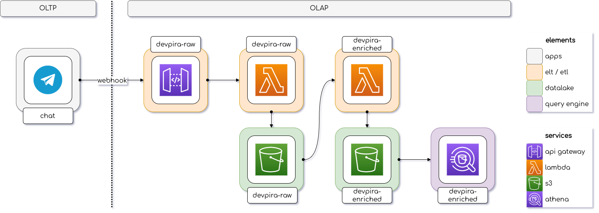

# DevPira Bot

> This project supported the [live](https://www.youtube.com/watch?v=sVFT-XK6rk4) bootcamp on how to develop OLAP systems made on [DevPira](https://devpira.com.br/) YouTube channel.

## Architecture

## CI/CD

